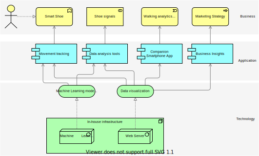

# Smart Shoe Design Doc
#### Authors: @andres-holguin
#### Reviewers: 
#### Status: Draft
#### Originallly Proposed: 2020-07-18 / Last Updated: 2020-07-18

## Objective
The smart shoe will allow anyone who wears shoes to experience walking in a new way that benefits from tracking foot movements and adjusting the foot environment.

Humans take almost 10,000 steps each day, but there is currently no way to gather useful information directly from our foot movements. The smart shoe will be able to collect and evaluate various metrics from foot movements to provide useful insights to the user. The smart shoe can also communicate to the user ways that they can improve their walking habits.

Goals:
- Improve the walking experience with real-time feedback.
- Provide movement analysis to users so they can see their habits change over time.
- Allow users to share their favorite foot feats on social media.

NON-Goals:
- Analyze the movement data of users for sale to advertisers.
- Directly alter a user's walking movements.
- Extend functionality outside of the foot region.

## Background
**TODO: Discuss walking statistics and previous attempts at walking tracking devices.**

## Requirements and Scale
**TODO: Expand on the following**

Shoe tracking features will meet the following requirements:

Provide useful data to users.

Encourage healthy walking habits.

Streamline the walking experience.

## Design Ideas
**TODO: Expand on the following**

The smart shoe will aim to solve the above requirements by:

Collecting data from walking movements.

Running that data through a machine learning algorithm that can identify inefficient walking.

Light/LED Display fixtures on the shoe that can provide real-time feedback to the user.

A companion app that will allow the user to review and share their walking highlights.

A data collection team that will analyze the data from users to guide marketing strategies.

###### A high level view of how the components of the smart shoe product will interact.

**TODO: Add examples of design mocks.**

## Timeline
| Feature | Time Estimate | Assignees |
| --- | --- | --- |
| Legal stuff: patents, regulations, etc. | 1 week | Legal |
| Base shoe design | 2 weeks | Design |
| Shoe color scheme selections | 3 weeks | Design: @pollock |
| Smartphone connectivity | 4 weeks | Hardware Engineering |
| Basic smartphone app | 3 weeks | Software Engineering |
| Develop and train machine learning model | 2 weeks | Software Engineering |
| Podiatric signaling research | 3 weeks | Research |
| Implement signaling technology | 2 weeks | Hardware Engineering |
| User testing | 3 weeks | Research |
| Marketing materials | 2 weeks | Design |
| Industry production | 5 weeks | Project Managers |

## Alternatives Considered

### Negative conditioning: 
In a previous iteration of this idea, there were plans to discourage poor foot placement by sending small shocks or vibrations when the user makes an improper step. This was discarded due to the costs involved with attaching a vibration device directly on the shoe.

### Smart pants:
Most of the features of the smart shoes can be affixed to a similarly fitted pair of pants. However, smart shoes will endure more wear and tear, encouraging users to purchase newer models as time goes on.